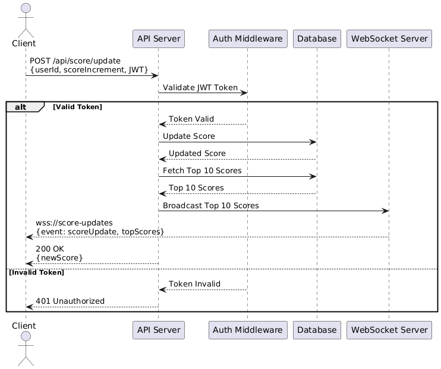

# Problem 6: Scoreboard API Module Specification

## Overview
The Scoreboard API Module provides a service that allows live scoreboard, display the top 10 user's scores. This module provides enpoints to update score and push real-time scores to connected clients. This module also prevents unauthorized users from update score

## Feature
- Scoreboard Retrieval: a GET enpoint to fetch the current top 10 scores.
- Score Update: increase user score.
- Live Updates: Use socket for real-time communication channel.
- Security: Validate update score API to prevent malicacious score manipulation. 

## Endpoints

### 1. POST `/api/score/update`
Updates a user's score after completing an action.

#### Request
- Method: POST
- URL: `/api/score/update`
- Headers:
  - `Authorization: Bearer <JWT_TOKEN>`
- Body:
  ```json
  {
    "userId": "string",  
    "scoreIncrement": "integer" 
  }
#### Response:
- Success: 200 OK

```
{
  "status": "success",
  "userId": "string",
  "newScore": "integer"
}
```
- Error: 401 Unauthorized
```
{
  "status": "error",
  "message": "Unauthorized Error"
}
```

### 2. GET `/api/score/top`:

#### Response:
```
{
  "status": "success",
  "scoreboard": [
    {
      "userId": "string",
      "username": "string",
      "score": "integer"
    }
  ]
}
```

### 3. Websocket enpoint `/ws/scoreboard`
#### Message Payload
```
{
  event": "scoreboard_update",
  "scoreboard": [
    {
      "userId": "string",
      "username": "string",
      "score": "integer"
    }
  ]
}
```

## Flow of execution


## Improvements
- Use cache to store and retrieve the top 10 scoreboard effciently